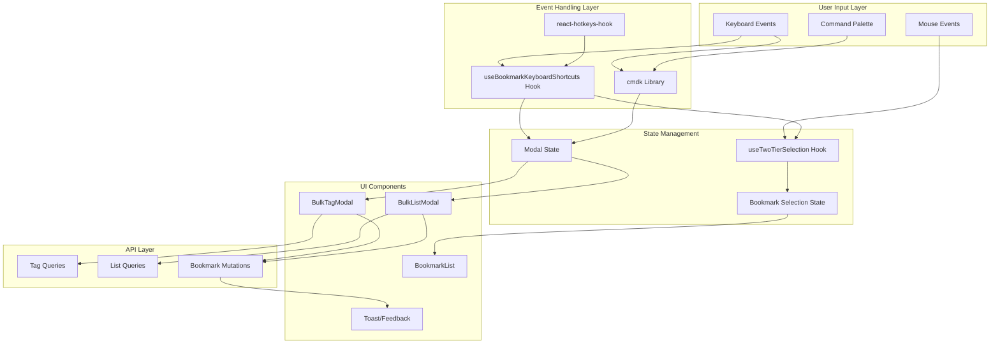
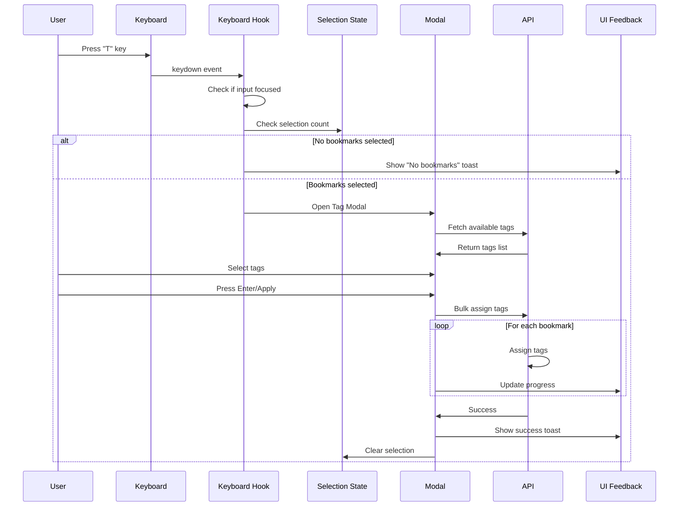
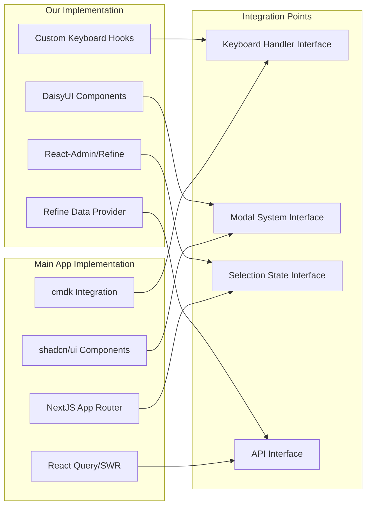
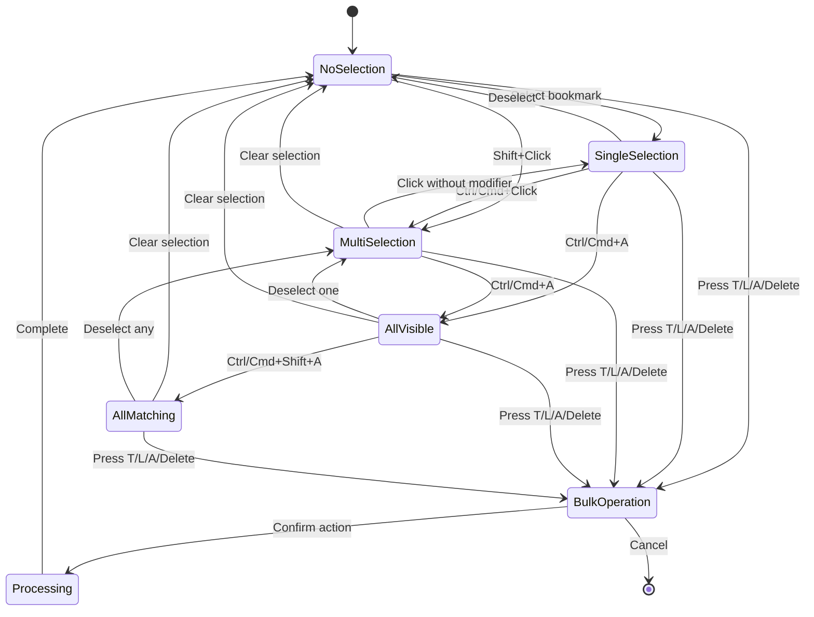
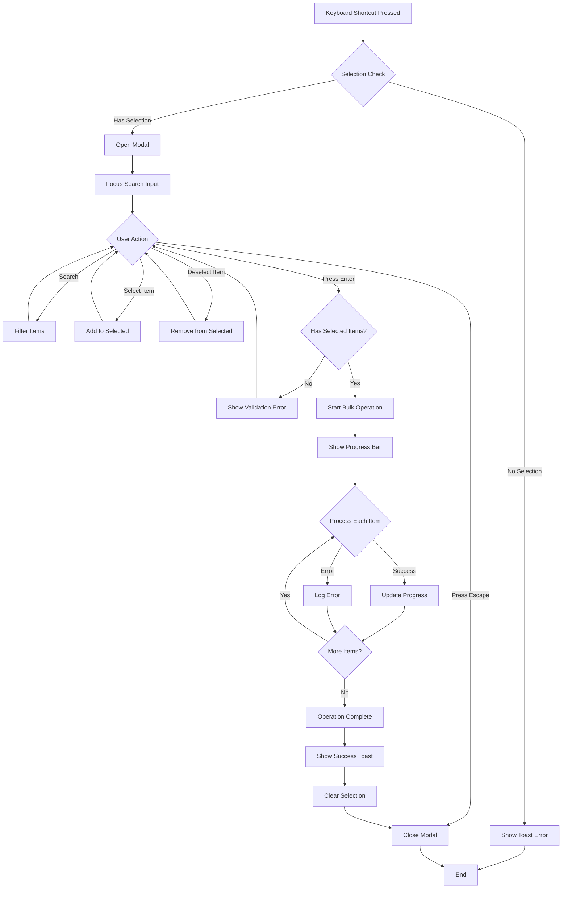
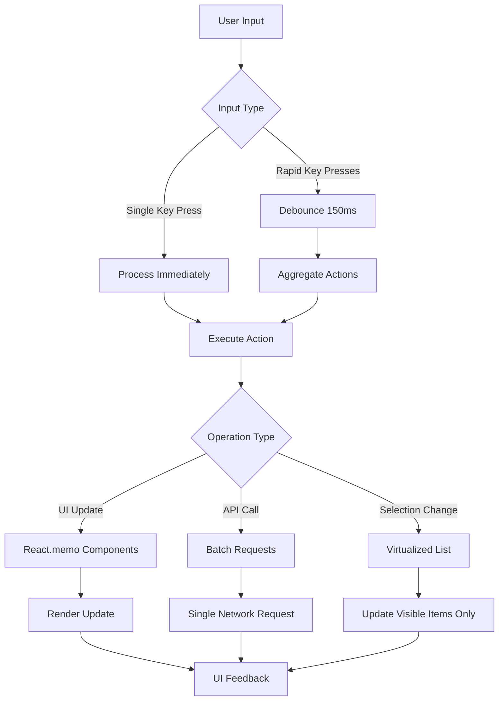
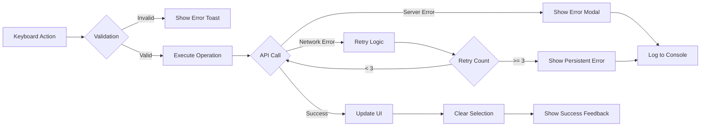
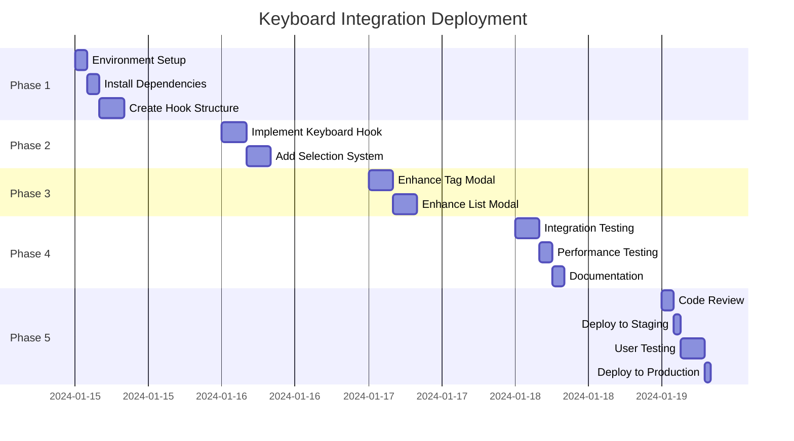

# Keyboard Integration Architecture

## System Architecture

## Keyboard Event Flow

## Component Integration Map

## Selection State Machine

## Modal Lifecycle

## Performance Optimization Strategy

## Error Handling Flow

## Deployment Strategy

---

These diagrams provide a visual understanding of:
1. How keyboard events flow through the system
2. Component integration points between our app and theirs
3. Selection state transitions
4. Modal lifecycle and error handling
5. Performance optimization strategies
6. Deployment timeline

Each diagram can be rendered using any Mermaid-compatible viewer or documentation system.